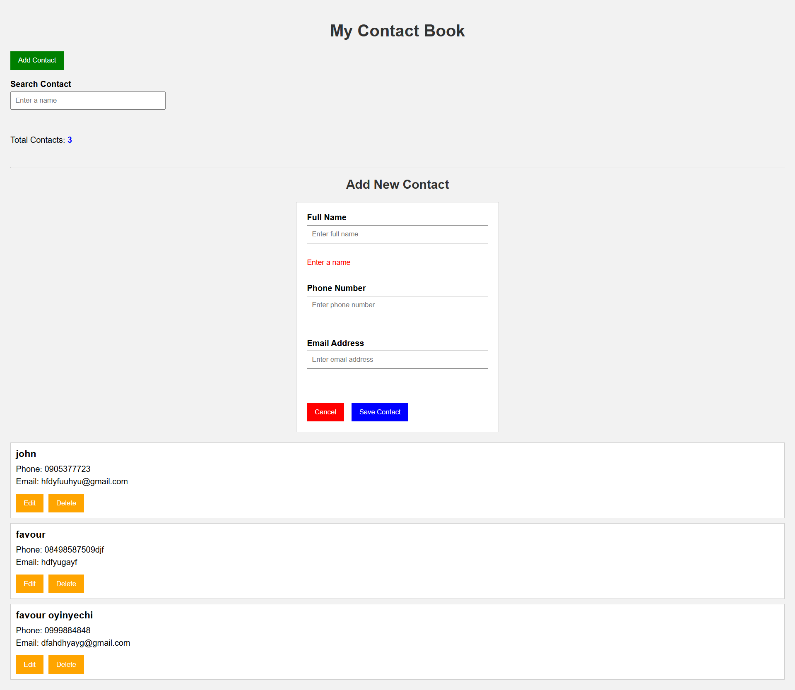

# Contact-book
# Contact Book

## About the Project

This is a simple Contact Book built with HTML, CSS, and JavaScript. It allows users to save and manage contact information in their browser.

## How the Project Works

* Enter a contact's **name**, **phone number**, and **email address**.
* Click the **Save** button to add the contact.
* The contact is displayed below the form.
* All contacts are saved in the browser using **Local Storage**, so they are still available after the page is refreshed.
* Use the **Search** box to find a contact by name.
* Click **Edit** to update a contact's information.
* Click **Delete** to remove a contact.
* The **Total Contacts** section shows how many contacts have been saved.
* Click **Cancel** to clear the form without saving.

## Files Used

* **index.html** – Creates the structure of the web page.
* **style.css** – Styles the page and makes it look neat.
* **script.js** – Handles adding, editing, searching, deleting, and saving contacts.

## test 
